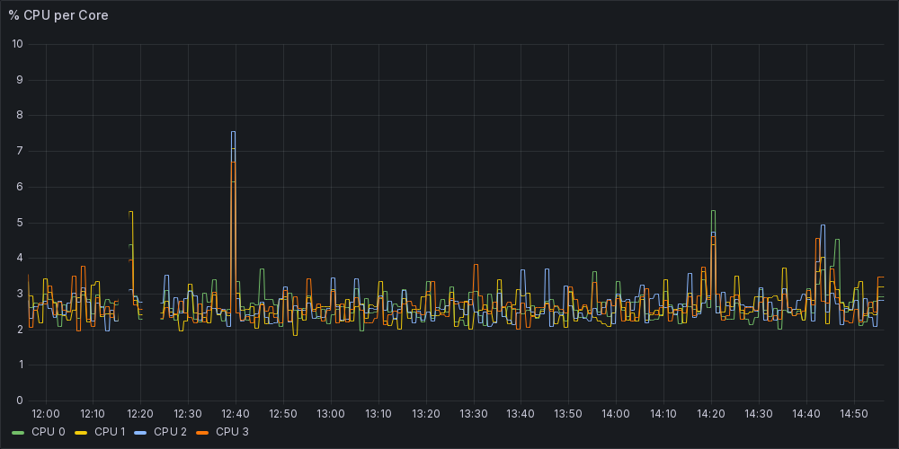

# Grafana + VictoriaMetrics + prometheus-podman-exporter

Minimal example for providing metrics visualizations of your podman containers

Tested with:

- podman 4.9.3 (rootless)

- portainer 2.19.5

- ubuntu 24.04

- grafana-oss 11.0.0

- grafana-image-renderer 3.11.0

- victoria-metrics 1.93.15

- node-exporter 1.8.1

- prometheus-podman-exporter 1.12.0

I pinned all version to get better reproducibility

## Grafana Manual Setup

1. Go to the Grafana Web Interface

2. Enter as admin:admin and change the password

3. On the menu Connections >> Add new connection search and add "VictoriaMetrics"

4. Fill the information needded. Only URL: http://victoria-metrics:8428 is needed
   Then Save + Test

5. And that's it.. go to the Dashboards and start creating your dashboards

### Using dashboards provided on this Git

Intended to get you started

1. Find the uid of the datasource you created ( in the url of the data source )

2. Replace every reference of the datasource uid provided in the repository, by the uid in 

3. Go to Dashboards and use the Import action on the changed files

## Bonus

### Generate Grafana panel png screenshots for your scripts

This requires you to generate a token. 

1. On Grafana go to Administration > Users and access > Service accounts

2. "Create service account", role viewer is enough

3. "Add service account token", give it a name and take note of the generated token

Next you will need the url for the rendered image the panel you want

1. On Grafana go to Dashboards

2. Select the Dashboard you want

3. Click on the 3 dots of the panel you want and select "Share"

4. Copy the link "Direct link rendered image"

Now adjust the following command to the information you collected

```bash
wget -O panel.png \
 --header="Authorization: Bearer ${TOKEN}" \
 "${IMAGE_URL}"
```

This should result on a panel.png 

You may need to adjust the "from" and "to" query parameters to relative values

If the "Direct link rendered image" does not appear there may me something wrong between grafana-image-renderer and grafana-oss

Example:



## Troubleshooting

Change docker-compose.yml and enable all the port mappings for each service

Check the output of every service:

For the exporters:

```
node-exporter: http://localhost:9100/metrics
prometheus-podman-exporter: http://localhost:9882/metrics
```

For victoria-metrics:

http://localhost:8428/targets
Here you can diagnose the connection to the exporters
